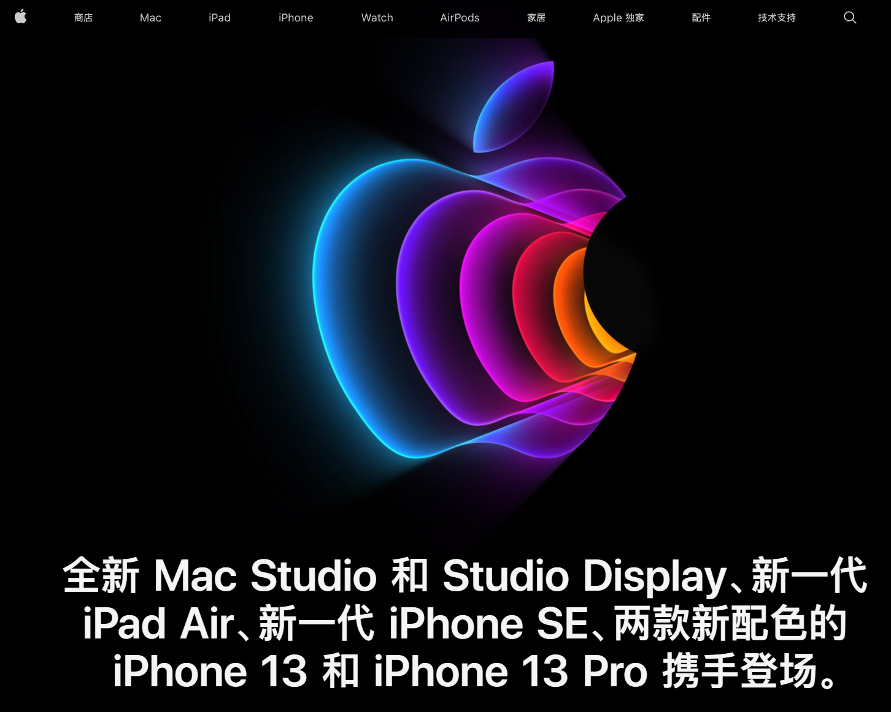
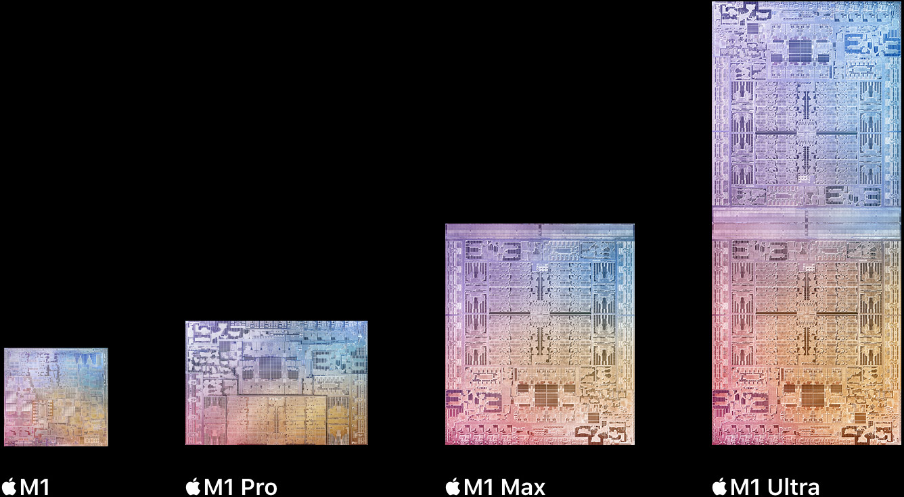
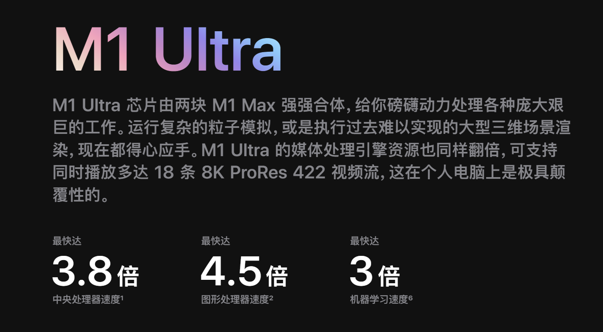

# 写在Apple2022年春季发布会之后

<iframe src="//player.bilibili.com/player.html?aid=637104874&bvid=BV1zb4y1W7Fe&cid=545115998&page=1" scrolling="no" border="0" frameborder="no" framespacing="0" allowfullscreen="true"> </iframe>

[Apple 活动 - 2022 年 3 月 - Apple (中国大陆)](https://www.apple.com.cn/apple-events/march-2022/)

2022年3月9日凌晨2点，我以当天的工图考试考爆为代价（虽然不看也会考爆），看了这场发布会。

本场发布会苹果发布了新iPhone SE，iPad Air5，**Mac Studio**和Studio Display四款新品，iPhone13系列新增了配色。时长为1个小时的发布会内容不可谓不多，但万众期待的新MacBook Air和M2芯片没有发布。

### 近两年Apple发布会给人的奇怪感觉

近两年关于Apple不再创新的论断已经几乎没有了，毫无疑问，Apple在个人电子设备领域不断地做出了一次又一次重大突破。遥记2020年Apple秋季发布会上登场的M1芯片，全新的架构为新设备带来了相当于老设备好几倍的性能，同时凭借ARM架构天然的省电特性，让仅重1.29kg的MacBook Air达到了惊人的18小时续航（我自己这台**丐中丐**版本8+256G版本MacBook Air实测**开PD虚拟机打galgame**一个多小时仅掉电**7%**，这可是经过了**2层转译**啊！）。

去年10月份发布的M1 Pro和M1 Max芯片进一步加大了芯片组的规模，达到了相当于X86平台i7-11800H+RTX3060 laptop组合的性能，同时功耗大大降低，使得搭载这颗芯片的MacBook Pro实现了不插电与插电相同性能。

[M1 Pro 与 M1 Max 隆重登场：Apple 迄今打造的最强芯片 - Apple (中国大陆)](https://www.apple.com.cn/newsroom/2021/10/introducing-m1-pro-and-m1-max-the-most-powerful-chips-apple-has-ever-built/)

同时由于**高通摆烂**和**华为被制裁**，Apple的老本行手机芯片与安卓阵营的差距进一步拉大，用苹果的原话说：“他们甚至还在追赶我们两年前发布的芯片！“

Apple在芯片上的巨大优势，使得近两年的发布会让人有种奇妙的感觉，**”除了芯片没活儿了！“**

仔细想想，确实是这样。

iPhone SE用6年前的外观换最新的A15芯片，新品！

iPad Air5从A14升级到桌面级的M1芯片，性能翻倍！不能说提升不大吧？新品！

Studio Display拿**A13芯片**当摄像头和音响驱动单元。最新的安卓旗舰手机打原神帧率甚至不如一个显示器（doge）。苹果仿佛在说：”我们知道显示器塞A13很奢侈，但没办法，这是我们在生产的性能最低的芯片。“（doge）~~你高通一届一届换了多少soc了，有用吗？换汤不换药啊！再下去要输显示器了，脸都不要了~~

**务实**成了Apple发布会的主旋律。MacBook Pro14英寸和16英寸的版本外观梦回PowerPC时代，接口数大大增加。Apple的Pro系列产品终于开始真正”Pro“，完全以实用为导向，在保证实用的基础上，做到尽量高水平的工业设计。

这些因素的共同作用导致现在Apple发布会的观感从**没有创新**到**东西很好，但完全可预测**。

### 狠角色M1 Ultra

[Mac Studio 和 Studio Display 登场 |bilibili](https://www.bilibili.com/video/BV1zb4y1W7Fe?spm_id_from=333.999.0.0)

[M1 Ultra | 颠覆游戏规则 |bilibili](https://www.bilibili.com/video/BV1hS4y1S7th?spm_id_from=333.999.0.0)

[Mac Studio - Apple (中国大陆)](https://www.apple.com.cn/mac-studio/)

两个M1 Max粘在一起。

看起来很简单粗暴，但是有很多问题可以深究。

两颗SOC是如何进行通讯的呢？一颗CPU如何访问另一颗CPU的寄存器，缓存？怎么进行算力资源分配？怎么保证**”胶水工艺“**的功耗和发热？这都属于普通消费者难以感知到的创新，但毫无疑问需要超高技术力去实现。~~（所以Mac Pro的芯片直接四颗M1 Max粘一起就好了（bushi））~~

这颗芯片的多核性能可以跟目前消费级市场霸主AMD线程撕裂者看齐，GPU性能看齐RTX3080桌面端，但这也带来了更多问题。

### 处于阵痛期的Apple Silicon

**这么强的芯片，我到底拿来干嘛？**

《三维大型场景渲染》（插件不支持ARM架构，怎么干活？没Cuda）

《深度学习》（Cuda已成事实上的标准，没Cuda）

《打游戏》（macOS上本来就没几个大作玩，现在换ARM架构，能玩的游戏就更少了）

《编程》（解释型语言基本上适配了，但是编译型语言比如说C语言就很难用，gdb也不能用，学X86平台的汇编基本别想。。。）

《Matlab》（MATLAB使用的是Intel MKL(Math Kernel Library)数学核心计算库，在英特尔芯片上能获得最佳性能）

《虚拟化技术》（目前macOS平台最强虚拟化软件parallel desktop只支持安装针对ARM架构的操作系统，你苹果有能力号召厂商适配ARM架构，Windows/Linux平台可没办法快速适配ARM）

《工业软件》（macOS奇缺）

剪视频？它确实很能剪视频，对于专门剪视频的工作室来说，这机子顶配才不到70000就有了之前30万的Mac Pro2倍的性能和更小的体积，甚至很有性价比。

但作为消费级最强芯片（可能），能干的事如此有限，是不是有点**可惜**？

从专精于某一特定领域到相对通用化的过程一定是艰难的。未来相当长的一段时间里，Apple Silicon将继续在它自己划定的范围里秒天秒地，但对当今购买计算机产品的主力人群即游戏玩家和工业软件使用者来说，它将直接不在考虑的范围之内。

~~macOS”咖喱味“越来越重了，bug明显比之前用x86平台的时候多了不少(~~

### 未来

过去苹果产品的性能不行导致众多生产力软件开发商和游戏开发者不愿意为苹果设备适配，但是如今Apple设备的性能全面跃进，也许以苹果的号召力，苹果会像如今在不到一年半的时间内让大部分常用软件适配Apple Silicon那样，在接下来的几年在多个领域全面开花也未可知。

（所以现在最香的是轻薄本，常用软件都适配了且续航超长~

现在英特尔/AMD与Apple涉及的领域不同，在非轻薄本领域几乎不构成直接竞争关系，随着Apple的生态越来越丰富，未来势必有场恶战。

~~美企之间互相卷，可怜我国产芯片与人家差距进一步拉大。~~

