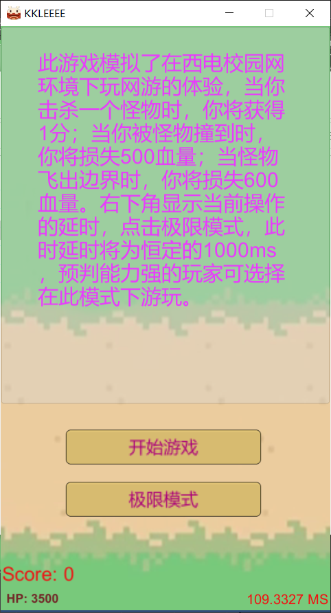
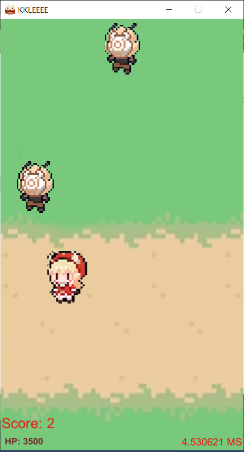
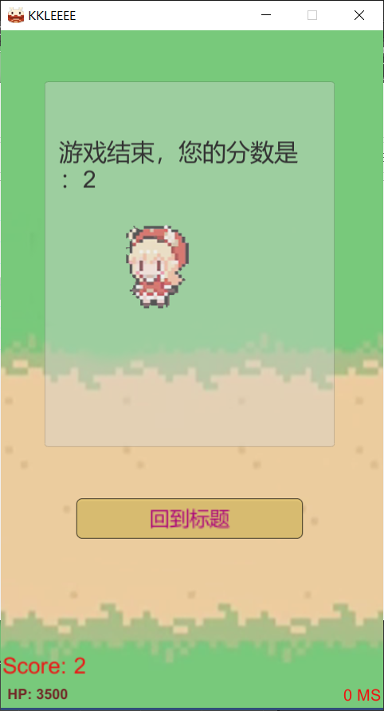
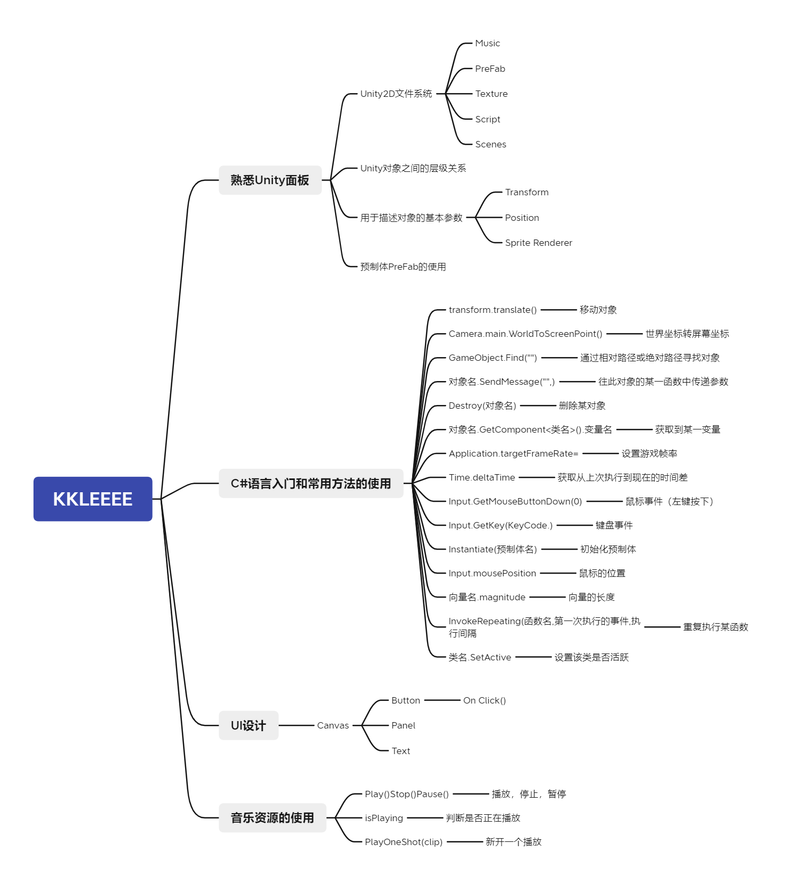

# KKLEEEE（Unity入门项目总结）


#### 项目构思与简介

套壳飞机大战加上模拟网络条件不佳的情况下产生的延迟（XDU校园网直呼内行）。

把飞机大战的壳换成了可莉发射蹦蹦炸弹打丘丘人（?

因为担心太简单所以另外开了个极限模式把延迟调到了1000ms，给喜欢操作的人留了很高的操作空间。

#### 项目说明

W：向上移动
A：向左移动
S：向下移动
D：向右移动
按下鼠标：丢出炸弹

#### 游戏实机截图







#### 项目技术路线

一个正常的Unity入门项目，运用到了一些Unity的基本知识。



物体之间的碰撞需要用到刚体的技术，在此项目中为Rigidbody 2D和Box Collider 2D元件。

刚体碰撞的代码的具体实现如下：

```c#
private void OnTriggerEnter2D(Collider2D collision)
{
    if (collision.tag.Equals("Monster"))
    {
        Destroy(collision.gameObject);
        Destroy(this.gameObject);
        GameObject Fa = GameObject.Find("Empty");
        Fa.SendMessage("AddScore", 1);
    }
}
```


#### 总结

总而言之是个非常基础的项目，了解了一下Unity2D的基本工作流。

链接：https://pan.baidu.com/s/18Is4HDqZL97i-scP0-b-Xg 
提取码：yliq 
--来自百度网盘超级会员V3的分享

链接：https://pan.baidu.com/s/1GXPYW85KffQoRN20MWjCtg 
提取码：xqra 
--来自百度网盘超级会员V3的分享
