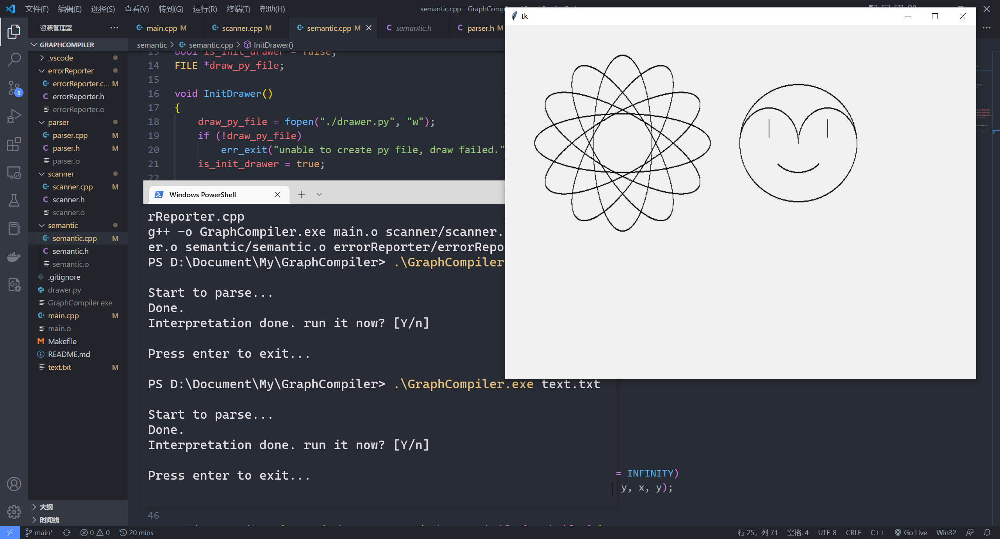

# 编译原理大作业报告


### 1. 上机题目简介

#### 上机实验的目的

通过做上机题加深对编译器构造原理和方法的理解，巩固所学知识。

1. 会用正规式和产生式设计简单语言的语法；

2. 会用递归下降子程序编写编译器或解释器；

#### 上机题目 - 简单函数绘图语言的解释器

1. **实现简单函数绘图的语句**

+ 循环绘图（**FOR-DRAW**）

+ 比例设置（**SCALE**）

+ 角度旋转（**ROT**）

+ 坐标平移（**ORIGIN**）

2. **屏幕（窗口）的坐标系**

+ 左上角为原点
+ x方向从左向右增长
+ y方向从上到小增长（**与一般的坐标系方向相反**）

3. **函数绘图源程序举例**

```cpp
--------------- 函数f(t)=t的图形
origin is (100, 300);	-- 设置原点的偏移量
rot is 0;			-- 设置旋转角度(不旋转)
scale is (1, 1);		-- 设置横坐标和纵坐标的比例
for T from 0 to 200 step 1 draw (t, 0);
				-- 横坐标的轨迹（纵坐标为0）
for T from 0 to 150 step 1 draw (0, -t);
				-- 纵坐标的轨迹（横坐标为0）
for T from 0 to 120 step 1 draw (t, -t);
				-- 函数f(t)=t的轨迹 
                    
默认值：
	origin is (0, 0)
	rot is 0;
	scale is (1, 1)
```


### 2. 开发环境及配置

**环境**：GNU-g++ 9.4.0/Python 3.9 tkinter

**文本编辑器**：Visual Studio Code

**构建工具**：GNU make

**代码仓库地址**：https://github.com/zeroy0410/GraphCompiler

#### 图形库依赖

需要运行环境下存在Python以及tkinter图形库。

#### 编译：

在代码所在目录，运行命令：

```bash
make
```

#### 使用

```bash
./GraphCompiler [ObjectFile] (可选参数"test"测试词法分析器)
```


### 3. 基本原理与解决思路

该项目由词法分析器（scanner）、语法分析器（parser）、语义分析器（semantic）组成。

#### 词法分析器

词法分析是计算机科学中将字符序列转换为记号（token）序列的过程。进行词法分析的程序或者函数叫作词法分析器（lexical analyzer，简称lexer），也叫扫描器（scanner）。词法分析器一般以函数的形式存在，供语法分析器调用。

本项目的记号如下表所示：

```cpp
enum Token_Type
{
	ORIGIN /* 0 */,
	SCALE /* 1 */,
	ROT /* 2 */,
	IS /* 3 */,
	TO /* 4 */,
	STEP /* 5 */,
	DRAW /* 6 */,
	FOR /* 7 */,
	FROM /* 8 */, //保留字
	T /* 9 */,	  //参数
	SEMICO /* 10 */,
	L_BRACKET /* 11 */,
	R_BRACKET /* 12 */,
	COMMA /* 13 */,
	PLUS /* 14 */,
	MINUS /* 15 */,
	MUL /* 16 */,
	DIV /* 17 */,
	POWER /* 18 */,
	FUNC /*19 */,
	CONST_ID /* 20 */,
	NONTOKEN /* 21 */,
	ERRTOKEN /* 22 */
};
```

存储Token的结构体如下所示：

```cpp
struct Token
{
	Token_Type type;		   //记号类别
	char *lexeme;			   //属性，字符串，指向char类型的指针
	double value;			   //属性，常数的值，double型
	double (*FuncPtr)(double); //属性，函数指针，代表一个指向返回double值并带有一个double形参的函数的指针的类型
};
```

本词法分析器采用一次扫描，程序不断从文件中读入字符，通过分隔符（空格、换行符）等将输入切分成一个一个的单词，再与字典中的记号匹配，进行记号的识别。详细的识别方法见代码，相当于做了单词的切分。

#### 语法分析器

语法分析器将为句子构建语法树，同时检查程序的语法错误。报告错误的代码笔者将其封装为了一个errorReporter库以供整个项目调用，代码如下所示：

```cpp
extern void err_exit(const char *msg, const char *err, int err_code)
{
    printf("Compiler fatal error: ");
    printf(msg, err);
    puts("\ncompilation terminated.");
    exit(err_code);
}
```

语法分析器根据一定的文法接收并匹配词法分析器识别到的记号，文法如下所示：

```
Expression ==> Term{(plus | minus)Term}
Term   ==> Factor{(mul | div)Factor}
Factor   ==> Plus Factor | Minus Factor | Component
Component==> Atom[Power Component]
Atom   ==> Const_ID | T | FUNC L_BRACKET Expression R_BRACKET | L_BRACKET Expression R_BRACKET
```

表达式的语法树如下所示：

```cpp
struct ExprNode{
    Token_Type OpCode;
    union{
        struct{//两个孩子的内部节点: 二元运算如PLUS, MUL等. 一元加, 一元减
            ExprNode *Left, *Right;
        } CaseOperator;
        struct{//一个孩子的内部节点: 函数调用
            ExprNode *Child;
            FuncPtr MathFuncPtr;
        }CaseFunc;
        double CaseConst;
        double *CaseParmPtr;
    }Content;
};
```

构建语法树的整体流程见代码parser.cpp。

整体算法流程如下：

语句的固定形式不外乎origin、scale、rot、for这几种，首先识别每条语句的开头Token，在分别匹配每种语句所需的Token，若能匹配则构建相应语法树，若不能则报告错误，代码如下所示：

```cpp
void parser()
{
    FetchToken();
    while (cur_token->type != NONTOKEN)
    {
        switch (cur_token->type)
        {
        case ORIGIN:
            origin_statement();
            break;
        case SCALE:
            scale_statement();
            break;
        case ROT:
            rot_statement();
            break;
        case FOR:
            for_statement();
            break;
        case T:
            break;
        case SEMICO:
            break;
        default:
            err_exit("", "", -EFAULT);
            break;
        }
        MatchToken(SEMICO);
    }
}
```

#### 语义分析器

笔者选择生成Python中间代码，并使用Python的tkinter图形库进行绘图。

语义分析器解析语法分析器构建的语法树，并负责中间代码生成。核心为：

1. 表达式值的计算：深度优先后序遍历语法树
2. 图形的绘制：画出每个坐标点

主要工作为：

1. 从origin, rot, scale中得到坐标变换所需的信息
2. DrawLoop语句根据每一个值进行处理, 包括计算点的坐标, 进行坐标变换, 绘制出该点

同时设计DrawPixel、GetCoordinate等函数进行辅助。

详见semantic.cpp。

### 4. 关键类及主要方法

#### 词法分析器

**Token_Type**：枚举类型，表示记号的分类。

**Token_Tab**：字典。

**Token**：用来存储记号的数据结构。

**InitScanner()**：初始化词法分析器。

**GetToken()**：从输入文件中获取一个记号。

**CloseScanner()**：关闭词法分析器。

#### 语法分析器

**ExprNode**：存储语法树结点的数据结构。

**MakeExprNode**：制作一个语法树节点。

**atom()**：匹配Atom文法。

**component()**：匹配Component文法。

**factor()**：匹配Factor文法。

**term()**：匹配Term文法。

**expression()**：匹配Expression文法。

**FetchToken()**：从词法分析器中获取一个记号，若是错误记号，报错。

**MatchToken()**：匹配记号，若不匹配，报错。

**origin_statement()**：处理Origin语句（scale_statement、rot_statement、for_statement）同理。

**parser()**：语法分析器暴露给main的接口。

#### 语义分析器

**GetExprVal()**：计算表达式树的值。

**DrawLoop()**：生成绘制函数的Python代码（此项目中此代码为中间代码）。

**CloseDrawer()**：关闭绘图。

**DrawPixel()**：绘制一个点。

**GetCoordinate()**：计算绘制点的坐标。


### 5. 测试截图



### 6. 总结体会

此次编译原理实验我收获颇丰。只有自己亲自完成整个过程才能对课本上的知识有着深入而直观的了解。在完成实验的过程中，我实践了词法分析、语法分析、语义分析的算法流程，提升了自己的工程能力。

